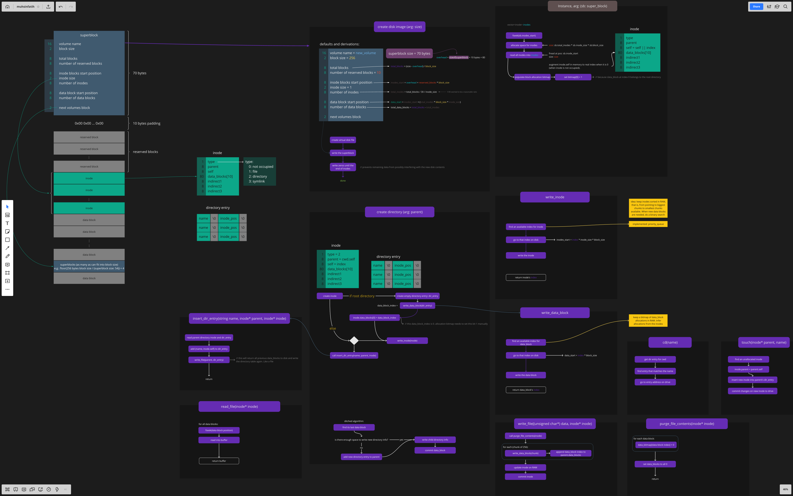

Muhsin Fatih Yorulmaz  
tuj54686  
Intro Systems Prog & Oper Sys Fall 2018 Project 4  

# Filesystem
In this project, I implemented a linux-like full binary filesystem. I used inodes and tried to implemented the filesystem in a maintainable fashion, meaning all the filesystem properties are variables that can be changed easily, like the block size, inode size in terms of blocks etc. I also partially implemented some features so that more advanced implementations can be added without too much change on the code. For example, volumes with varying sizes can be added via partitioning to the filesystem, features like journaling symlinking can be added without much effort (If I had more time before finals I was going to implement them as well). The program takes in inputs from the command line. I have implemented a very similar prompt to the one I did in the project 2: linux command line

## Introduction
mufafs is a filesystem that makes use of inodes and indirect addressing. Basic functionalities are:
```
ls:         list files & folder in current dictionary
cd:         navigate to a folder
cat:        print file contents
mkdir:      create folder
touch:      create file
write:      write to file
rm:         remove (recursive)
reformat:   reformat disk
```
## Compiling & Example usage
Building & Running:  
You need the readline library to build the program. I have included a binary just in case.
```
make && ./main
```
Usage:
```
mufafs ➜ ls
mufafs ➜ mkdir subdir
mufafs ➜ touch file
mufafs ➜ ls
    subdir
    file
mufafs ➜ write file some\ content
mufafs ➜ cat file
    some content
mufafs ➜ write file overwriting\ content
mufafs ➜ cat file
    overwriting content
mufafs ➜ cd subdir
mufafs ➜ ls
mufafs ➜ mkdir subsubdir
mufafs ➜ write file2 this\ file\ is\ under\ a\ subdirectory
mufafs ➜ ls
    subsubdir
    file2
mufafs ➜ cat file2
    this file is under a subdirectory
mufafs ➜ cd ..
mufafs ➜ ls
    subdir
    file
mufafs ➜ rm file
mufafs ➜ ls
    subdir
mufafs ➜ rm subdir
mufafs ➜ ls
```

# Program design
At the beginning of the filesystem, a superblock resides, which holds information about the volume. Following are the values with their sizes on disk for a superblock:
```
16 volume name
2 block size

8 total blocks
8 number of reserved blocks

8 inode blocks start position
2 inode size
8 number of inodes

8 data block start position
8 number of data blocks

2 next volumes block
```
I used inodes for files and folders, and stored inodes in the memory to track allocation & allocate/deallocate faster. A priority queue holds all the inodes. Prioritizing for following factors in given order: 
1. de-allocated inodes are first
2. contiguous inodes first

For data blocks, keeping a pointer in ram of each data block would require too much memory. Instead, a bitmap is stored. Each time an allocation is necessary, the program finds an un-allocated memory using this bitmap. The bitmap and the inode map are always kept in sync with the drive, so the program never needs to read an inode from disk after mounting.

There are 10 direct, and 3 indirect data address spaces for each inode. First indirect address is single indirection, second indirect address is double indirection and the third indirect address is triple indirection.

Each inode has the following data spaces:
```
type
parent
self
data_blocks[10]
indirect1
indirect2
indirect3
```

And this is how the directory entries are structured in data blocks:
```
name\0inode_position\0
name\0inode_position\0
name\0inode_position\0
...
```

Rest of the implementation is too complicated for me to explain in a readme file, so I created a diagram that expresses the entire workings of the program and all the data structures (you might want to open it in an external program, image is very big): 
